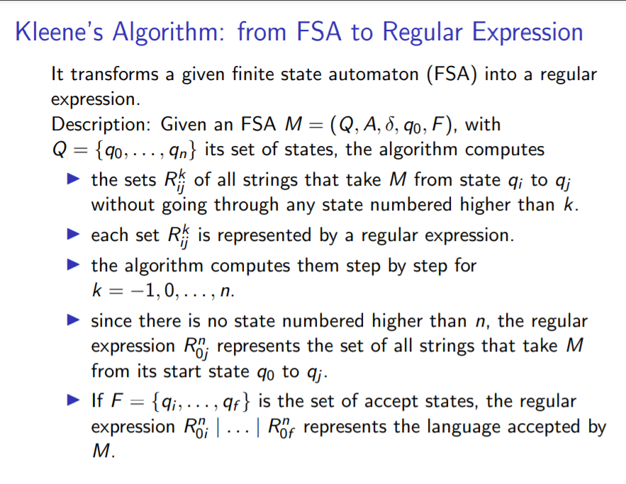
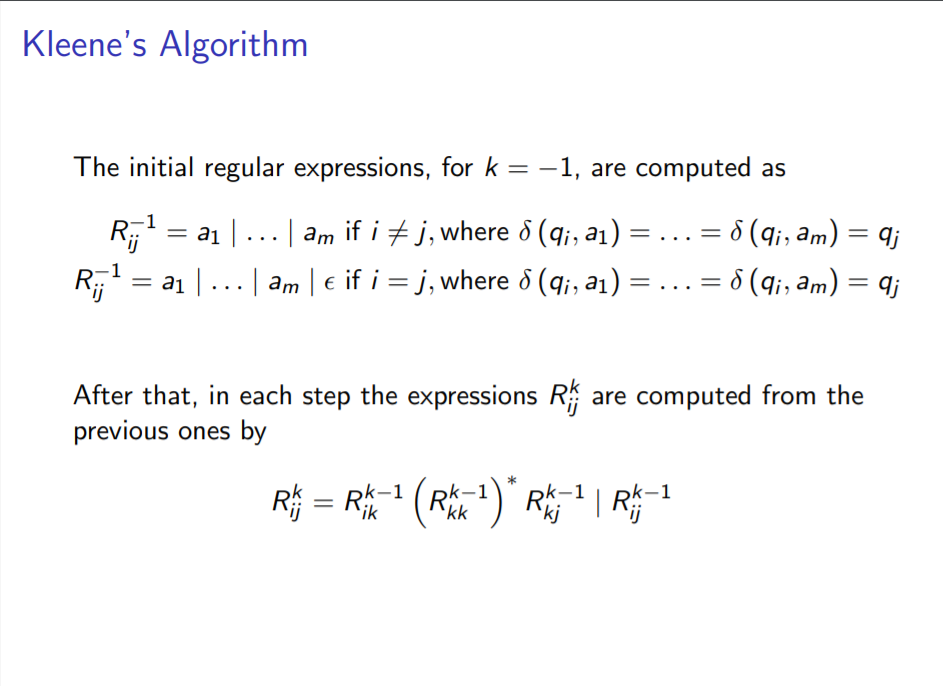

========================
FSA to RegExp Translator
========================

Implement an FSA to RegExp Translator. Given an FSA description in the input.txt (see input file format) your program should output the output.txt containing an error description (see validation errors) or a regular expression that corresponds to the given FSA. The regular expression should be built according to a slightly modified version of the Kleene’s algorithm (see Kleene's algorithm).

Input file format
*****************

states=[s1,s2,...]	// s1 , s2, ... ∈ latin letters, words and numbers

alpha=[a1,a2,...]	// a1 , a2, ... ∈ latin letters, words, numbers and character '_’(underscore)

initial=[s]	// s ∈ states

accepting=[s1,s2,...]	// s1, s2 ∈ states

trans=[s1>a>s2,...]	// s1,s2,...∈ states; a ∈ alpha

Validation result | Errors:
***************************

Note:

The errors may appear in the inputs, which should lead to error message according to the 
priority given below. 

Only 1 error message should be shown, if required. 

It should be assumed that for each line read from the inputs all the possible errors should be 
checked in the given priority, if applicable for the current line.

E1: Input file is malformed

E2: Initial state is not defined

E3: Set of accepting states is empty

E4: A state 's' is not in the set of states

E5: A transition 'a' is not represented in the alphabet

E6: Some states are disjoint

E7: FSA is nondeterministic

Kleene’s Algorithm
******************

Denote ∅ as {}

Denote Ɛ as eps

Example 1
*********
input.txt

.. code:: text

      states=[on,off]
      alpha=[turn_on,turn_off]    
      initial=[off]
      accepting=[]
      trans=[off>turn_on>off,on>turn_off>on]
 
output.txt

.. code:: text

      E2: Some states are disjoint

Example 2
*********

input.txt

.. code:: text

      states=[0,1]
      alpha=[a,b]
      initial=[0]
      accepting=[1]
      trans=[0>a>0,0>b>1,1>a>1,1>b>1]
      
output.txt

.. code:: text

      ((a|eps)(a|eps)*(b)|(b))(({})(a|eps)*(b)|(a|b|eps))*(({})(a|eps)*(b)|(a|b|eps))|((a|eps)(a|eps)*(b)|(b))

Example 3
*********
input.txt

.. code:: text

      states=[on,off]
      alpha=[turn_on,turn_off]
      initial=[off]
      accepting=[]
      trans=[off>turn_on>on,on>turn_off>off]
      
output.txt

.. code:: text

      E3: Set of accepting states is empty
      
      
Example 4
*********
input.txt

.. code:: text

      states=[on,off,op]
      alpha=[turn_on,turn_off,A,B]
      initial=[off]
      accepting=[op]
      trans=[off>turn_on>on,on>turn_off>off,op>A>on,off>B>op]
      
output.txt

.. code:: text

      ((((eps)(eps)*(turn_on)|(turn_on))((turn_off)(eps)*(turn_on)|(eps))*((turn_off)(eps)*(B)|({}))|((eps)(eps)*(B)|(B)))((({})(eps)*(turn_on)|(A))((turn_off)(eps)*(turn_on)|(eps))*((turn_off)(eps)*(B)|({}))|(({})(eps)*(B)|(eps)))*((({})(eps)*(turn_on)|(A))((turn_off)(eps)*(turn_on)|(eps))*((turn_off)(eps)*(B)|({}))|(({})(eps)*(B)|(eps)))|(((eps)(eps)*(turn_on)|(turn_on))((turn_off)(eps)*(turn_on)|(eps))*((turn_off)(eps)*(B)|({}))|((eps)(eps)*(B)|(B))))

